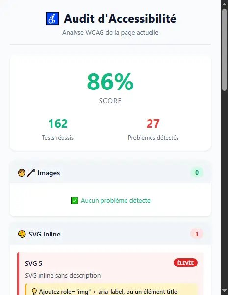

# 🌐 Audit d'Accessibilité Web - Extension Chrome

> Extension Chrome professionnelle pour auditer l'accessibilité des sites web selon les normes WCAG 2.1

[](https://github.com/Caro639/accessibility-audit-extension)
[](https://www.w3.org/WAI/WCAG21/quickref/)
[](https://developer.mozilla.org)
[](https://jestjs.io/)
[](./test.md)



## 📖 Description

Extension Chrome permettant d'auditer l'accessibilité d'une page web en temps réel selon les normes **WCAG 2.1**. Elle analyse automatiquement la page active et génère un rapport détaillé avec des marqueurs visuels sur les éléments problématiques.

### 🎯 Objectif

Faciliter l'identification et la correction des problèmes d'accessibilité pour rendre le web plus inclusif pour tous, notamment les personnes en situation de handicap.

## ✨ Fonctionnalités

### Analyses automatiques

- **🖼️ Images** : Détection des images sans attribut `alt` avec marqueurs visuels
- **🎨 SVG Inline** : Vérification des SVG inline sans description accessible
- **🔗 Liens** : Vérification des liens sans texte descriptif
- **📋 Titres** : Validation de la hiérarchie des titres (H1-H6)
- **📝 Formulaires** : Contrôle des champs sans étiquettes `<label>`
- **👁️ Filtre Daltonisme** : Test de perception des couleurs pour les personnes daltoniennes
- **🏗️ Structure** : Vérification de l'attribut `lang`, landmarks ARIA et boutons

### Fonctionnalités avancées

✅ **Marqueurs visuels** - Bordures de couleur animées + badges sur les éléments problématiques  
✅ **Navigation rapide** - Boutons "Voir dans la page" pour scroller vers les erreurs  
✅ **Score global** - Calcul du taux de conformité en temps réel  
✅ **Export de rapport** - Téléchargement d'un rapport texte détaillé  
✅ **Messages pédagogiques** - Explications de l'importance de chaque critère  
✅ **Tests unitaires** - à réaliser avec Jest (70%+ de couverture)

## 🚀 Installation

### Prérequis

- Google Chrome (version 88+)
- Mode développeur activé

### Étapes d'installation

1. **Cloner le repository**

   ```bash
   git clone https://github.com/Caro639/accessibility-audit-extension.git
   cd accessibility-audit-extension
   ```

2. **Charger l'extension dans Chrome**
   - Ouvrez `chrome://extensions/`
   - Activez le **Mode développeur**
   - Cliquez sur **Charger l'extension non empaquetée**
   - Sélectionnez le dossier du projet

3. **Utiliser l'extension**
   - Visitez n'importe quelle page web
   - Cliquez sur l'icône de l'extension
   - Consultez le rapport d'accessibilité

## 📸 Captures d'écran

### Interface principale


### Marqueurs visuels


### Rapport détaillé


## 🛠️ Technologies

- **Manifest V3** - Dernière version des extensions Chrome
- **JavaScript ES6+** - Vanilla JS, pas de frameworks
- **Chrome Extensions API** - Permissions, Content Scripts, Messaging
- **CSS3** - Animations, Flexbox, Grid
- **WCAG 2.1** - Standards d'accessibilité

## 📂 Structure du projet

```plaintext
accessibility-audit-extension/
├── manifest.json          # Configuration de l'extension (Manifest V3)
├── content.js            # Analyse du DOM et détection des problèmes
├── popup.html            # Interface utilisateur du popup
├── popup.js              # Logique du popup et communication
├── popup.css             # Styles de l'interface
├── README.md             # Documentation (vous êtes ici)
└── README-DEV.md         # Notes de développement
```

## 💻 Utilisation

### 1. Installation des dépendances (pour développeurs)

```bash
npm install
```

### 2. Lancer les tests

```bash
# Exécuter tous les tests
npm test

# Exécuter les tests en mode watch (développement)
npm run test:watch

# Générer un rapport de couverture
npm run test:coverage
```

📖 **[Voir le guide complet des tests](./test.md)**

### 3. Lancer un audit

Cliquez sur l'icône de l'extension pour analyser automatiquement la page active.

### 4. Consulter les résultats

- **Score global** affiché en haut
- **Problèmes classés** par catégorie et sévérité
- **Compteurs** de tests réussis/échoués

### 5. Navigation vers les erreurs

Cliquez sur **"Voir dans la page"** pour scroller automatiquement vers l'élément problématique.

### 6. Exporter le rapport

Cliquez sur **"📥 Exporter le rapport"** pour télécharger un fichier texte détaillé.

### 7. Effacer les marqueurs

Cliquez sur **"🧹 Effacer les marqueurs"** pour retirer les bordures rouges de la page.

## 🎓 Ce que ce projet démontre

### Compétences techniques

✅ Développement d'extensions Chrome (Manifest V3)  
✅ Manipulation avancée du DOM  
✅ Architecture logicielle (séparation des préoccupations)  
✅ Communication inter-composants (Message Passing)  
✅ Calculs d'accessibilité (structure, sémantique)
✅ UI/UX moderne et responsive  
✅ Gestion des événements et animations CSS  
✅ **Tests unitaires avec Jest (70%+ de couverture)**  
✅ **Développement piloté par les tests (TDD)**  
✅ **Configuration d'environnement de test pour extensions Chrome**

### Connaissances métier

✅ Normes WCAG 2.1 (A, AA, AAA)  
✅ Accessibilité web (a11y)  
✅ Attributs ARIA  
✅ Standards HTML5 sémantiques  
✅ Tests manuels et automatisés à réaliser

## 🚧 Roadmap / Améliorations futures

- [x] Tests unitaires avec Jest ✅
- [x] Couverture de code 70%+ ✅
- [ ] Support de WCAG 3.0 (WCAG-Next)
- [ ] CI/CD avec GitHub Actions
- [ ] Intégration avec axe-core pour analyses avancées
- [ ] Export PDF avec jsPDF ou copier dans le presse-papiers pour un partage rapide et facile sur tout support.
- [ ] Export audit en print version à imprimer dans un nouveau onglet
- [ ] Mode sombre
- [ ] Historique des audits (Chrome Storage API)
- [ ] Support multilingue (i18n)
- [ ] Graphiques visuels avec Chart.js

## 🤝 Contribution

Les contributions sont les bienvenues ! N'hésitez pas à :

1. Fork le projet
2. Créer une branche (`git checkout -b feature/amelioration`)
3. Commit vos changements (`git commit -m 'Ajout d'une fonctionnalité'`)
4. Push vers la branche (`git push origin feature/amelioration`)
5. Ouvrir une Pull Request

## 📄 Licence

Ce projet est sous licence MIT - voir le fichier [LICENSE](LICENSE) pour plus de détails.

## 📬 Contact

**Développé par** : [Votre Nom]  
**Email** : [werner.carole7@gmail.com](mailto:werner.carole7@gmail.com)  
**LinkedIn** : [Votre profil LinkedIn](https://www.linkedin.com/in/carole-werner-096a9b212)  
**Portfolio** : [votre-portfolio.com](https://caro-developpeur.ozya.fr/)

## 🙏 Remerciements

- [MDN Web Docs](https://developer.mozilla.org/) - Documentation exhaustive
- [W3C WAI](https://www.w3.org/WAI/) - Standards WCAG
- [Chrome Extensions](https://developer.chrome.com/docs/extensions/) - Documentation officielle
- [WebAIM](https://webaim.org/) - Ressources sur l'accessibilité

---

⭐ **Si ce projet vous a été utile, n'hésitez pas à lui donner une étoile !**

---

**Faisons ensemble un web plus accessible pour tous** 🌍♿
