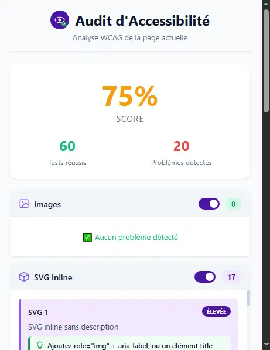
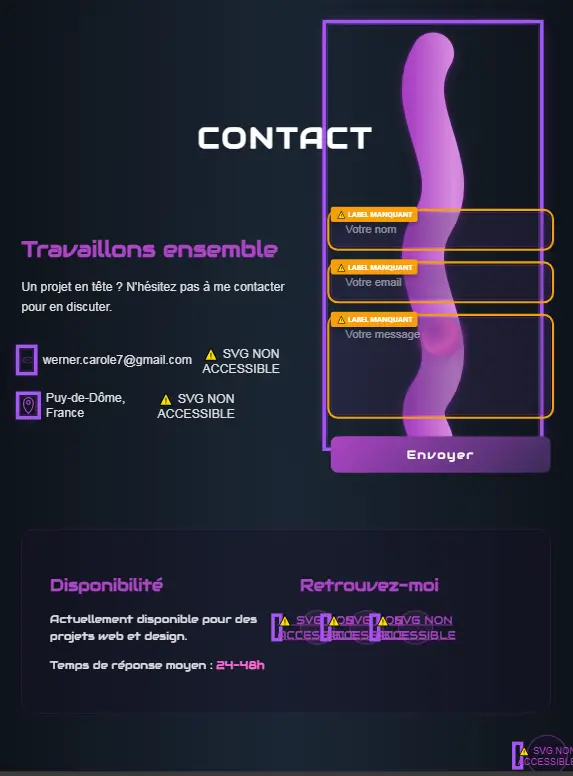
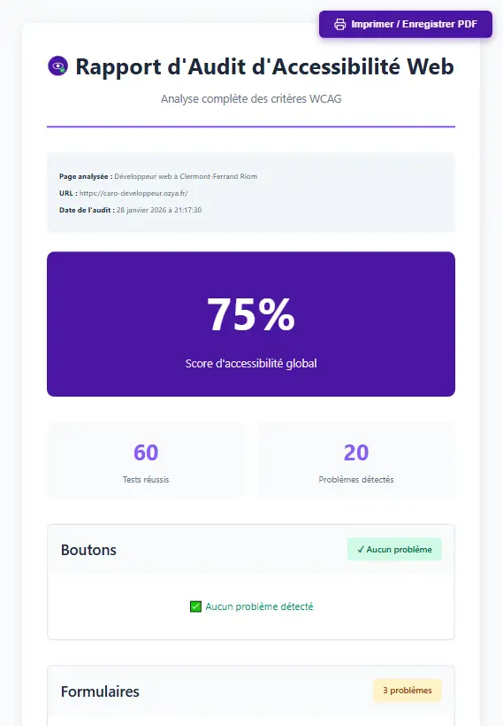
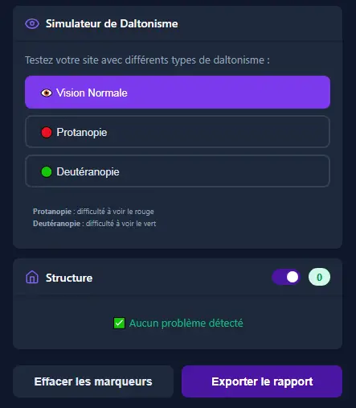

#  QuickA11y - Quick Accessibility Audit

> Extension Chrome pour identifier et corriger rapidement les problèmes d'accessibilité selon les normes WCAG 2.1

[](https://github.com/Caro639/accessibility-audit-extension)
[](https://www.w3.org/WAI/WCAG21/quickref/)
[](https://developer.mozilla.org)
[](https://jestjs.io/)
[](./test.md)


## � Table des matières

- [ QuickA11y - Quick Accessibility Audit](#-quicka11y---quick-accessibility-audit)
  - [� Table des matières](#-table-des-matières)
  - [�📖 Description](#-description)
    - [🎯 Objectif](#-objectif)
  - [✨ Fonctionnalités](#-fonctionnalités)
    - [Analyses automatiques](#analyses-automatiques)
    - [Fonctionnalités avancées](#fonctionnalités-avancées)
  - [🚀 Installation](#-installation)
    - [Prérequis](#prérequis)
    - [Étapes d'installation](#étapes-dinstallation)
  - [📸 Captures d'écran](#-captures-décran)
    - [Interface principale](#interface-principale)
    - [Marqueurs visuels](#marqueurs-visuels)
    - [Rapport détaillé](#rapport-détaillé)
    - [Mode Daltonisme \& Dark Mode](#mode-daltonisme--dark-mode)
  - [🛠️ Technologies](#️-technologies)
  - [📂 Structure du projet](#-structure-du-projet)
  - [💻 Utilisation](#-utilisation)
    - [1. Lancer un audit](#1-lancer-un-audit)
    - [2. Consulter les résultats](#2-consulter-les-résultats)
    - [3. Navigation vers les erreurs](#3-navigation-vers-les-erreurs)
    - [4. Corriger les problèmes rapidement](#4-corriger-les-problèmes-rapidement)
    - [5. Effacer les marqueurs](#5-effacer-les-marqueurs)
    - [6. Mode Daltonisme](#6-mode-daltonisme)
  - [👨‍💻 Développement](#-développement)
    - [1. Installation des dépendances](#1-installation-des-dépendances)
    - [2. Lancer les tests](#2-lancer-les-tests)
  - [🎓 Ce que ce projet démontre](#-ce-que-ce-projet-démontre)
    - [Compétences techniques](#compétences-techniques)
    - [Connaissances métier](#connaissances-métier)
  - [🚧 Roadmap / Améliorations futures](#-roadmap--améliorations-futures)
  - [🤝 Contribution](#-contribution)
  - [📄 Licence](#-licence)
  - [📬 Contact](#-contact)
  - [🙏 Remerciements](#-remerciements)

## �📖 Description

Extension Chrome permettant d'auditer l'accessibilité d'une page web en temps réel selon les normes **WCAG 2.1**. Elle analyse automatiquement la page active et génère un rapport détaillé avec des marqueurs visuels sur les éléments problématiques.

### 🎯 Objectif

Faciliter l'identification et la correction des problèmes d'accessibilité pour rendre le web plus inclusif pour tous, notamment les personnes en situation de handicap.

## ✨ Fonctionnalités

### Analyses automatiques

- **🖼️ Images** : Détection des images sans attribut `alt` avec marqueurs visuels
- **🎨 SVG Inline** : Vérification des SVG inline sans description accessible
- **🔗 Liens** : Vérification des liens sans texte descriptif
- **📋 Titres** : Validation de la hiérarchie des titres (H1-H6)
- **📝 Formulaires** : Contrôle des champs sans étiquettes `<label>`
- **🎨 Contraste des couleurs** : Vérification automatique du ratio de contraste WCAG 2.1 AA (texte sur fonds unis)
- **👁️ Filtre Daltonisme** : Test de perception des couleurs pour les personnes daltoniennes
- **🏗️ Structure** : Vérification de l'attribut `lang`, landmarks ARIA et boutons

### Fonctionnalités avancées

✅ **Marqueurs visuels** - Bordures de couleur animées + badges sur les éléments problématiques  
✅ **Navigation rapide** - Boutons "Voir dans la page" pour scroller vers les erreurs
✅ **Catégorisation des problèmes** - Par type et sévérité (Erreur, Avertissement, Info)
✅ **Ressources utiles** - Liens MDN et WebAIM pour chaque critère non conforme
✅ **Score global** - Calcul du taux de conformité en temps réel  
✅ **Export de rapport** - Téléchargement d'un rapport texte détaillé  
✅ **Messages pédagogiques** - Explications de l'importance de chaque critère  
✅ **Vérification du contraste** - Analyse WCAG 2.1 AA du ratio de contraste (4.5:1 pour texte normal, 3:1 pour texte large)
✅ **Tests unitaires** - 193+ tests Jest avec couverture 70%+

## 🚀 Installation

### Prérequis

- Google Chrome (version 88+)
- Mode développeur activé

### Étapes d'installation

1. **Cloner le repository**

   ```bash
   git clone https://github.com/Caro639/accessibility-audit-extension.git
   cd accessibility-audit-extension
   ```

2. **Charger l'extension dans Chrome**
   - Ouvrez `chrome://extensions/`
   - Activez le **Mode développeur**
   - Cliquez sur **Charger l'extension non empaquetée**
   - Sélectionnez le dossier du projet

3. **Utiliser l'extension**
   - Visitez n'importe quelle page web
   - Cliquez sur l'icône de l'extension
   - Consultez le rapport d'accessibilité

## 📸 Captures d'écran

### Interface principale



### Marqueurs visuels



### Rapport détaillé



### Mode Daltonisme & Dark Mode



## 🛠️ Technologies

- **Manifest V3** - Dernière version des extensions Chrome
- **JavaScript ES6+** - Vanilla JS, pas de frameworks
- **Chrome Extensions API** - Permissions, Content Scripts, Messaging
- **CSS3** - Animations, Flexbox, Grid
- **WCAG 2.1** - Standards d'accessibilité

## 📂 Structure du projet

```plaintext
quicka11y/
├── manifest.json                # Configuration de l'extension (Manifest V3)
├── package.json                 # Dépendances et scripts NPM
├── .gitignore                   # Fichiers à ignorer par Git
├── eslint.config.js             # Configuration ESLint (Flat Config)
├── jest.config.cjs              # Configuration Jest pour les tests
├── jest.setup.js                # Configuration de l'environnement de test
├── mock-extension-apis.js       # Mocks Chrome API pour les tests (Google recommandations)
├── LICENSE                      # Licence MIT
├── README.md                    # Documentation (vous êtes ici)
├── README-DEV.md                # Notes de développement
├── test.md                      # Résultats des tests
├── icon*.png                    # Icônes de l'extension (16, 48, 128)
├── *.webp                       # Captures d'écran pour la documentation
├── test-*.html                  # Pages HTML de test
├── src/
│   ├── content/
│   │   └── content.js           # Analyse du DOM et détection des problèmes
│   ├── popup/
│   │   ├── popup.html           # Interface utilisateur du popup
│   │   ├── popup.js             # Logique du popup et communication
│   │   ├── popup.css            # Styles de l'interface
│   │   ├── popup-utils.js       # Fonctions pures utilitaires (Clean Code)
│   ├── report/
│   │   ├── report.html          # Page de rapport détaillé
│   │   └── report.js            # Logique du rapport
│   └── utils/
│       ├── constants.js         # Constantes partagées (timeouts, scores)
│       └── markdown.js          # Génération et export Markdown
└── tests/
    ├── content.test.js          # Tests unitaires pour content.js (65 tests)
    ├── popup.test.js            # Tests unitaires pour popup.js (144 tests)
    └── report.test.js           # Tests unitaires pour report.js (33 tests)
```

## 💻 Utilisation

### 1. Lancer un audit

Cliquez sur l'icône de l'extension pour analyser automatiquement la page active.

### 2. Consulter les résultats

- **Score global** affiché en haut
- **Problèmes classés** par catégorie et sévérité
- **Messages pédagogiques** expliquant chaque critère
- **Ressources** pour chaque critère non conforme
- **Activer/Désactiver** chaque type de test individuellement
- **Compteurs** de tests réussis/échoués

### 3. Navigation vers les erreurs

Cliquez sur **"Voir dans la page"** pour scroller automatiquement vers l'élément problématique.

### 4. Corriger les problèmes rapidement

- Cliquez sur **"Copier Markdown"** pour copier le rapport dans le presse-papiers en format Markdown
- Ou cliquez sur **"Exporter le rapport"** pour télécharger un fichier PDF détaillé

### 5. Effacer les marqueurs

Cliquez sur **"Effacer les marqueurs"** pour retirer toutes les bordures de couleur des éléments problématiques sur la page.

### 6. Mode Daltonisme

Activez le filtre daltonisme pour tester la perception des couleurs sur la page.

## 👨‍💻 Développement

### 1. Installation des dépendances

```bash
npm install
```

### 2. Lancer les tests

```bash
# Exécuter tous les tests
npm test

# Exécuter les tests en mode watch (développement)
npm run test:watch

# Générer un rapport de couverture
npm run test:coverage
```

📖 **[Voir le guide complet des tests](./test.md)**

## 🎓 Ce que ce projet démontre

### Compétences techniques

✅ Développement d'extensions Chrome (Manifest V3)  
✅ Manipulation avancée du DOM  
✅ Architecture logicielle (séparation des préoccupations)  
✅ Communication inter-composants (Message Passing)  
✅ Calculs d'accessibilité (structure, sémantique)
✅ UI/UX moderne et responsive  
✅ Gestion des événements et animations CSS  
✅ **Tests unitaires avec Jest (70%+ de couverture)**  
✅ **Développement piloté par les tests (TDD)**  
✅ **Configuration d'environnement de test pour extensions Chrome**

### Connaissances métier

✅ Normes WCAG 2.1 (A, AA, AAA)  
✅ Accessibilité web (a11y)  
✅ Attributs ARIA  
✅ Standards HTML5 sémantiques  
✅ Tests manuels et automatisés à réaliser

## 🚧 Roadmap / Améliorations futures

- [x] Tests unitaires avec Jest ✅
- [x] Couverture de code 70%+ ✅
- [x] **Intégration du calcul du contraste (WCAG 2.1 AA)** ✅
- [ ] Support de WCAG 3.0 (WCAG-Next)
- [ ] CI/CD avec GitHub Actions
- [ ] Intégration avec axe-core pour analyses avancées
- [ ] Export audit en print version à imprimer dans un nouvel onglet
- [ ] Historique des audits (Chrome Storage API)
- [ ] Support multilingue (i18n)
- [ ] Graphiques visuels avec Chart.js

## 🤝 Contribution

Les contributions sont les bienvenues ! N'hésitez pas à :

1. Fork le projet
2. Créer une branche (`git checkout -b feature/amelioration`)
3. Commit vos changements (`git commit -m 'Ajout d'une fonctionnalité'`)
4. Push vers la branche (`git push origin feature/amelioration`)
5. Ouvrir une Pull Request

## 📄 Licence

Ce projet est sous licence MIT - voir le fichier [LICENSE](LICENSE) pour plus de détails.

## 📬 Contact

**Développé par** : [Carole Werner]  
**Email** : [werner.carole7@gmail.com](mailto:werner.carole7@gmail.com)  
**LinkedIn** : [Votre profil LinkedIn](https://www.linkedin.com/in/carole-werner-096a9b212)  
**Portfolio** : [votre-portfolio.com](https://caro-developpeur.ozya.fr/)

## 🙏 Remerciements

- [MDN Web Docs](https://developer.mozilla.org/) - Documentation exhaustive
- [W3C WAI](https://www.w3.org/WAI/) - Standards WCAG
- [Chrome Extensions](https://developer.chrome.com/docs/extensions/) - Documentation officielle
- [WebAIM](https://webaim.org/) - Ressources sur l'accessibilité

---

⭐ **Si ce projet vous a été utile, n'hésitez pas à lui donner une étoile !**

---

**Faisons ensemble un web plus accessible pour tous** 🌍♿
